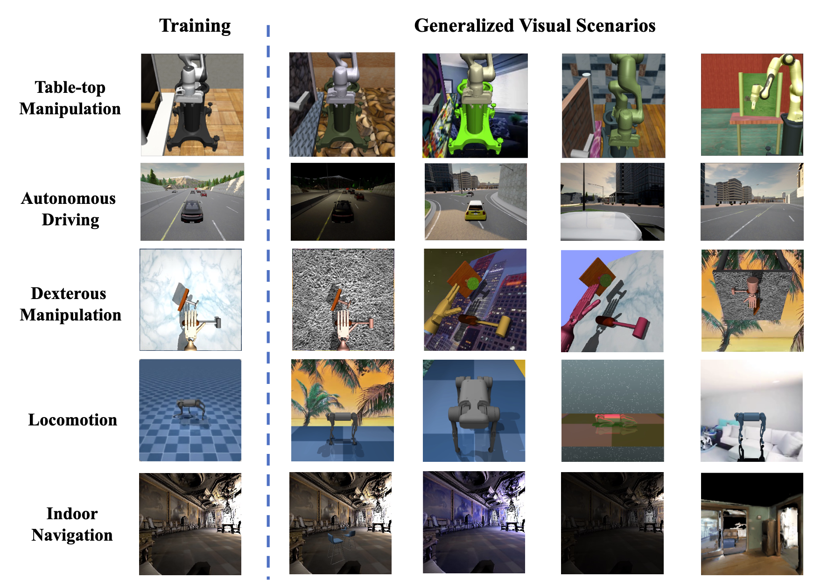

# RL-ViGen: A Reinforcement Learning Benchmark for Visual Generalization
This repository is a fork of the original RL-ViGen repository that allows easy installation of just the environments while requiring the strict minimum of dependencies (no PyTorch pinned version restriction, no Hydra, no Tensorboard, no Weights & Biases dependencies).  
This is useful to quickly install and instantiate the environments for R&D purposes and quick prototyping.  

Note : This repo is a WIP currently

[RL-ViGen Authors' Website](https://gemcollector.github.io/RL-ViGen/) | [RL-ViGen Paper](https://arxiv.org/abs/2307.10224)
<p align="center">
  

[comment]: <> (  )

[comment]: <> (  )

[comment]: <> (  )

[comment]: <> (  )

[comment]: <> (  )

[comment]: <> (  )

[comment]: <> (  )

[comment]: <> (  )

[comment]: <> (  )
 </p>

[comment]: <> (## Method)

[comment]: <> (DrQ-v2 is a model-free off-policy algorithm for image-based continuous control. DrQ-v2 builds on [DrQ]&#40;https://github.com/denisyarats/drq&#41;, an actor-critic approach that uses data augmentation to learn directly from pixels. We introduce several improvements including:)

[comment]: <> (- Switch the base RL learner from SAC to DDPG.)

[comment]: <> (- Incorporate n-step returns to estimate TD error.)

[comment]: <> (- Introduce a decaying schedule for exploration noise.)

[comment]: <> (- Make implementation 3.5 times faster.)

[comment]: <> (- Find better hyper-parameters.)

[comment]: <> (<p align="center">)

[comment]: <> (  )

[comment]: <> (</p>)

[comment]: <> (These changes allow us to significantly improve sample efficiency and wall-clock training time on a set of challenging tasks from the [DeepMind Control Suite]&#40;https://github.com/deepmind/dm_control&#41; compared to prior methods. Furthermore, DrQ-v2 is able to solve complex humanoid locomotion tasks directly from pixel observations, previously unattained by model-free RL.)

[comment]: <> (<p align="center">)

[comment]: <> (  )

[comment]: <> (  )

[comment]: <> ( </p>)


# Portable Installation
The following will install the dependencies and environments required by RL-ViGen.  
After the installation, one can import the environments in python and create them for train/eval purposes.
1. Manually download Gibson Full scene datasets : https://github.com/facebookresearch/habitat-sim/blob/main/DATASETS.md#gibson-and-3dscenegraph-datasets
    - This step is manual because you must sign a form to download the data (out of our control).
1. Extract the gibson scene dataset archive to `data/datasets/gibson_full/`
1. Create a conda environment  
    ```shell
    conda create -f environment.yaml -y
    ```
    - This will create a conda env named `rl-vigen-portable`, alternatively, take a look at the `environment.yaml` file and add the dependencies to your existing conda environment.
1. Activate the conda environment  
    ```shell
    conda activate rl-vigen-portable
    ```
1. Download external datasets & setup Carla sim  
    ```shell
    bash setup.sh
    ```
1. Add wrappers and carla to your PYTHONPATH, run the following **from the root of the repository** :  
    ```shell
    export PYTHONPATH=$(pwd):third_party/CARLA_0.9.12/PythonAPI/carla:$PYTHONPATH
    ```
At the end, your `data/` folder should look like this :  
```shell
data/
  |
  -- datasets/
        |
        -- gibson_full/
        -- pointnav/
```  
# Documentation  
See **doc/** folder for documentation on how to create environments, a **README** with minimum working examples is created for each environment.  

# Important
Many code changes were done so that the environments no longer depend on a Hydra config to be created. Instead, the functions that allow the creation of the environments expect a python dictionary with the config for the environment.   
An easy way to use this is to use Hydra **in your own repository** and simply convert your hydra `DictConfig` object to a python `dict` using `OmegaConf.to_container(my_hydra_dict_config)`.  
This was done to make you the owner of the Hydra config, you can setup Hydra the way you want and simply pass a dict now.

## Code Structure
- `envs`: various RL-ViGen benchmark environments. In addtion, each sub-folder contains specific `README.md` for the introduction of the environment.
- `third_party`: submodules from third parties. We won't frequently change the code in this folder.
- `wrappers`: includes the wrappers for each environment.

If you find RL-ViGen useful in your research, please consider citing the authors work as follows:

## Citations

```
@article{yuan2023rl,
  title={RL-ViGen: A Reinforcement Learning Benchmark for Visual Generalization},
  author={Yuan, Zhecheng and Yang, Sizhe and Hua, Pu and Chang, Can and Hu, Kaizhe and Wang, Xiaolong and Xu, Huazhe},
  journal={arXiv preprint arXiv:2307.10224},
  year={2023}
}
```
